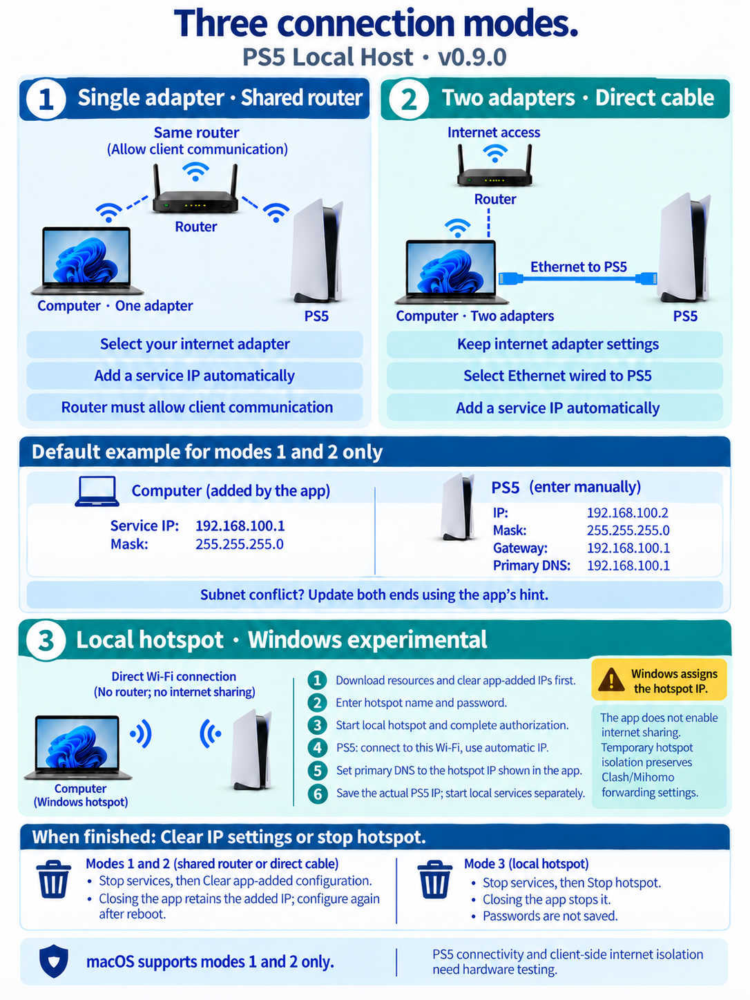
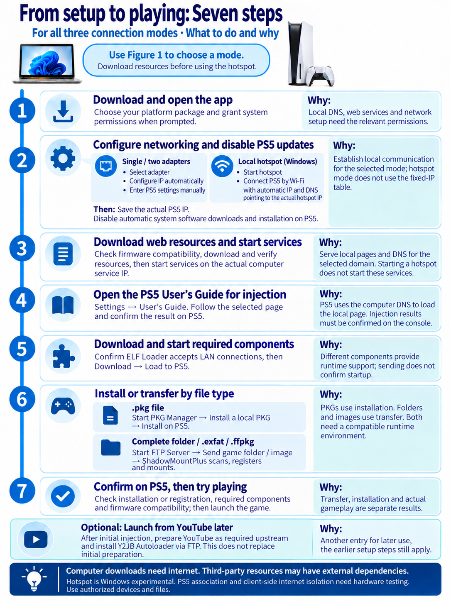

# PS5 Local Host

[简体中文](README.md) | [English](README.en.md)

Host local injection pages, manage components and install authorized local game files from your computer. Use a shared router with one adapter, a direct Ethernet cable with two adapters, or a Windows local hotspot for a direct wireless connection (experimental).

**[Download the latest version](https://github.com/MarcusYuan/ps5-lan-workbench/releases/latest)** · [Detailed guide](guides/usage.en.md) · [Contact and feedback](#contact-and-community)

For first use, follow two figures: **[Figure 1: Three connection modes and IP settings](#connection-and-ip-settings)** helps you choose a connection; **[Figure 2: The complete seven-step workflow](#seven-steps-from-setup-to-playing)** explains what to do next, how and why.

> For technical exchange and authorized testing. Web resources, third-party ELFs, and game content are not bundled. PS5 hardware compatibility still requires verification; a completed transfer does not confirm successful execution on the console.

## Download and open

Expand **Assets** on the download page and choose a package for your computer:

| Your computer | Filename contains | How to open |
| --- | --- | --- |
| 64-bit Windows | `windows-x64-setup.exe` | Install, then launch |
| 64-bit Windows, portable use | `windows-x64-portable.exe` | Launch directly |
| Mac with Apple silicon (M series) | `macos-arm64.dmg` | Open the DMG and drag the app into Applications |
| Mac with an Intel processor | `macos-x64.dmg` | Open the DMG and drag the app into Applications |

ZIP packages are also available for macOS. **Source code contains the source files; choose an app package from the table.** Builds are unsigned and macOS builds are not notarized, so your system may block opening them.

## Save management

Under “Install components”, find **Garlic SaveMgr**, then click “Download” → “Load to PS5” → “Open save manager”. Jailbreak first and start a LAN-accessible ELF Loader. Export a backup in the web UI before editing or importing saves. [Detailed steps](guides/usage.en.md#garlic-savemgr-save-management)

## Connection and IP settings

**Single- and two-adapter modes add a service IP. Local hotspot mode, introduced in v0.9.0, uses an address assigned by Windows. All three preserve existing computer internet settings.** Verify console network settings and its actual target IP on PS5, then enter them as described below.

### 1. Choose the mode that matches your connection

| Mode | Connection | Adapter to select |
| --- | --- | --- |
| Single adapter | Computer and PS5 connect to the same router. Both can use Wi-Fi, or one can be wired and the other wireless | The computer's current internet adapter |
| Two adapters | One adapter provides internet access; another connects directly to PS5 by cable | The adapter connected to PS5 |
| Local hotspot (Windows experimental) | The computer broadcasts Wi-Fi; PS5 connects directly without a router or cable in this link | The app identifies the hotspot virtual adapter and selects its actual IP |

Single-adapter mode suits laptops with only one usable adapter: **the same adapter retains its internet IP and gains an additional service IP**. The router must allow device communication: disable AP/client isolation and avoid isolated guest networks. Two-adapter mode adds the service IP to the adapter wired to PS5, which must not have a default gateway.

**For hotspot mode, go directly to “Mode 3” below. Steps 2–4, the added-IP settings table and its cleanup instructions apply only to modes 1 and 2.** Hotspots require compatible Wi-Fi Direct hardware and drivers; macOS supports the first two modes only.

**Figure 1: Three connection modes and IP settings.** Fixed-address examples are separate from hotspot automatic addressing.

### 2. Modes 1 and 2: Add the computer IP automatically

1. Under **Connection mode and computer IP setup** at the top of the app, select the mode and adapter from the table above.
2. **Service IP to add** defaults to `192.168.100.1`. If a subnet overlaps, check the named adapter or route and click **Use suggested IP** or enter another subnet. Click **Configure IP automatically** and complete Windows/macOS authorization. Stop local services and finish or cancel downloads and transfers first.
3. Wait for the result. Confirm that **Computer network interface** below has selected the actual configured service IP. Successful configuration selects this address for local DNS and web services automatically.

**Why:** the service IP supports local computer-to-PS5 communication, while the original address continues to serve the computer's internet connection. Automatic configuration does not require replacing the original IP in system adapter properties or disabling DHCP.

### 3. Modes 1 and 2: Enter the PS5 settings manually

For single-adapter mode, select the PS5 network connected to the shared router. For two-adapter mode, select the wired connection to the computer. Choose manual IP and DNS settings and enter:

| Setting | Computer: app adds or preserves | PS5: enter manually |
| --- | --- | --- |
| Service IP / IP address | Add `192.168.100.1`; retain existing IPs | `192.168.100.2` |
| Subnet mask | Use `255.255.255.0` for the added address | `255.255.255.0` |
| Default gateway | Preserve existing settings; add no gateway for the service IP | `192.168.100.1` |
| DNS | Preserve existing settings | Primary DNS: `192.168.100.1` |

Back in the app, enter `192.168.100.2` under **PS5 IP** and click **Save PS5 address**. Also disable automatic system software downloads and installation on PS5. The app does not change these console settings for you.

**Why:** the computer service IP and PS5 IP share a subnet, and PS5 primary DNS points to the computer's local service. This gateway is for local access; the app does not enable internet sharing or bridging and does not forward internet traffic to PS5.

> **Subnet conflict?** These are defaults, not mandatory fixed addresses. Choose another unused private service IP ending in `.1`, then update PS5 IP, gateway and primary DNS as shown in the app. For example, service IP `172.31.253.1` pairs with PS5 IP `172.31.253.2`, gateway and primary DNS `172.31.253.1`, and mask `255.255.255.0`. This example must also pass the local conflict check.

Before switching from single- to two-adapter mode, **Clear app-added configuration**, then select the adapter wired to PS5. The app identifies the overlapping adapter address or route and offers **Use suggested IP** when a candidate is available. Original internet addresses are preserved, and a broad mask may still overlap with the default service subnet. The input retains the address for your next configuration; check **Current addresses on this adapter** for actual addresses. Suggestions pass only the computer configuration checks; PS5 connectivity still needs verification.

### 4. Modes 1 and 2: Clear the configuration or use it again later

- **Clear:** stop local services and finish downloads, transfers and remote tasks, then click **Clear app-added configuration**. Only the app's additions are removed. Original IPs and internet settings, including a pre-existing service address, are preserved. Manually entered PS5 settings must be changed separately.
- **Close the app:** the added address stays for the current boot and can be reused when the app opens again.
- **Restart the computer:** temporary addresses expire; click **Configure IP automatically** again. Expiration after reboot has not been hardware-tested. See the [detailed guide](guides/usage.en.md#automatic-ip-configuration-and-cleanup) for failures and recovery.

The computer needs internet access for initial downloads. Cached resources and local files can then be used over the local network; third-party resources may have their own internet dependencies. Automatic configuration has been tested on one Windows computer for actual address addition and cleanup on Ethernet and Wi-Fi while preserving existing internet settings. macOS hardware operation and PS5 connectivity remain unverified.

### 5. Mode 3: Windows local hotspot (experimental)

Select **Local hotspot · Windows experimental** to broadcast password-protected Wi-Fi from your computer and connect PS5 directly. The computer retains its original network for downloads. The app does not enable internet sharing for PS5 and installs temporary hotspot isolation rules. macOS is unsupported; PS5 association and device-side internet isolation still need hardware testing.

1. **Prepare:** download pages and required components first; stop services and finish downloads and transfers. If you used either adapter mode, **Clear app-added configuration** first. Turn off Windows Mobile hotspot, internet sharing and bridging.
2. **Start on the computer:** choose hotspot mode, enter a name and password, click **Start local hotspot** and complete system authorization. Names contain 1–32 ASCII characters, start with a letter or digit and may include spaces, `_` or `-`. Passwords accept 8–63 printable ASCII characters without spaces. Passwords are not saved and must be entered on each start.
3. **Connect PS5:** select this Wi-Fi name and enter its password. Use **automatic IP** first and wait for the computer hotspot IP in the app. If no usable address appears after connection, inspect the adapter, driver and interface error; do not bypass checks by copying the fixed-address table.
4. **Set DNS and choose a device:** manually set PS5 primary DNS to the displayed computer hotspot IP while retaining automatic IP. Do not add a public secondary DNS. Click **View connected devices**, verify the actual IP on PS5, select it and click **Confirm as PS5**. The list does not identify PS5 automatically; confirm a target before starting services.
5. **Start services separately:** the app selects the actual hotspot interface; click **Start local services**, then continue with Figure 2. A started hotspot does not establish that DNS/web services are running or PS5 has accessed the page.
6. **Stop:** stop services and finish downloads and transfers, then click **Stop hotspot**. Closing the app also stops it. Restart the hotspot next time and check its new address instead of reusing the previous one. Disable PS5 automatic updates yourself.

| Hotspot setting | What to use |
| --- | --- |
| Computer hotspot IP | The actual Windows-assigned address displayed by the app |
| PS5 IP, mask and gateway | Automatic; do not copy the fixed-address table for modes 1 and 2 |
| PS5 primary DNS | Manually enter the current computer hotspot IP; avoid public secondary DNS |
| PS5 IP in the app | The actual address checked on the console, selected and confirmed from connected devices |

**For example**, if the app shows `192.168.137.1`, use it for primary DNS. This was observed on the tested computer and is not a fixed address for every system. Do not click Configure IP automatically in hotspot mode. DNS resolves only the configured target domain and does not forward other queries. A failed internet connection test alone does not establish that the local page is unreachable.

Temporary hotspot isolation rules block IPv4/IPv6 forwarding to other networks and restrict access to local services. Forwarding settings on other adapters, including Clash/Mihomo, are preserved. Existing sharing, bridges or active Wi-Fi Direct interfaces still prevent startup; failed isolation stops the hotspot. PS5 connectivity and device-side internet isolation still require testing. [Limitations and diagnostics](guides/usage.en.md#windows-local-hotspot-experimental)

Windows initially selects hotspot mode; macOS selects single adapter. Subsequent launches remember the user's choice, without automatically starting a hotspot or requesting authorization. The hotspot list refreshes from current connection endpoints about every two seconds, rather than reading DHCP leases or scanning the LAN. Stop services and finish or cancel remote tasks before selecting again. Disconnection, lost list updates or a hotspot restart require renewed confirmation; another device is never selected automatically.

## Seven steps from setup to playing

All three modes follow the steps below. Follow Figure 1's branch in step 2. Download required resources before using the hotspot; its setup does not use the fixed-address table for the first two modes.

**Figure 2: The complete workflow from setup to playing.** Each step includes its action and purpose. Step 6 branches by file type; YouTube is an optional entry after initial preparation.

| Step | What to do | Why |
| --- | --- | --- |
| 1. Download and launch | Get the app using the download link above. On Windows, right-click and select “Run as administrator.” On macOS, grant permissions when starting services. | Local DNS and web services need the relevant ports and system permissions. |
| 2. Configure the network and disable automatic updates | Single/two adapters: select the adapter, configure IP automatically and enter PS5 settings manually. Hotspot: start it, connect PS5 by Wi-Fi with automatic IP and primary DNS pointing to the actual hotspot IP. Verify and save the PS5 address in all modes. Disable automatic system software downloads and installation on PS5. | Establish local communication; hotspots use assigned addresses. Disabling automatic updates reduces firmware compatibility changes. |
| 3. Download the web repository and start services | “File source” defaults to the [Relapse repository](https://github.com/ntfargo/Relapse-Exploit), with `index.html` as the entry file. Check firmware compatibility, then click “Download and verify” → “Start local services.” You can use another authorized repository or direct HTTPS ZIP URL. Saved sources are retained. | The prefilled URL saves finding and copying the address; downloaded resources let the computer provide local web and DNS services to PS5. |
| 4. Open the PS5 User's Guide for injection | Go to Settings → Guide & Tips, Health & Safety, and Other Information → User's Guide. Follow the selected page's instructions and confirm the injection result on the console. Menu names can vary with language or firmware. | Primary DNS directs the relevant User's Guide domain to the computer. Injection behavior and firmware compatibility depend on the selected repository. |
| 5. Manage and send components from the computer | Download components by purpose. For ELF payloads, confirm the PS5 Loader accepts connections, click “Load on PS5,” and confirm startup on the console. Y2JB uses the FTP installation described below. | Different components provide transfer, installation, mounting and runtime support; start the required services on the console first. |
| 6. Install or transfer by file type | For `.pkg`, start PKG Manager and use “Install a local PKG.” For complete folders or `.exfat` / `.ffpkg`, start FTP Server and use “Send game folder / image,” then let ShadowMountPlus scan, register and mount. Keep the computer and files available until the task finishes. | PKGs use installation; folders and images use file transfer and a loader. Both paths require a compatible runtime environment. |
| 7. Confirm the result and start playing | Check installation on the PS5 and try launching the game. Confirm that required components are running and the content matches your firmware. | Transfer completion, successful installation, and actual startup are separate states; check the console's result. |

### Which components go with which task?

| Your task | Components to use | Confirm on PS5 |
| --- | --- | --- |
| Install a `.pkg` file | PKG Manager handles installation; runtime and firmware must be compatible | Installation result, then try launching |
| Send a complete game folder or `.exfat` / `.ffpkg` image | FTP Server receives files; ShadowMountPlus scans, registers and mounts with a compatible Kstuff environment | Scan and registration notifications, then try launching |
| Manage files and payloads | FTP Server / Web File Manager manage files; Payload Manager manages payloads, as needed | The required service has started and is accessible |
| Choose an entry for later launches | WebKit Autoloader and Y2JB Autoloader are different entries; Y2JB requires preparation and FTP installation below | Actual execution of the selected entry |

Third-party capabilities and compatibility depend on their documentation and hardware results. [Full component details and prerequisites](guides/usage.en.md#components-and-local-pkgs)

For a complete game folder or an `.exfat` / `.ffpkg` image, step 6 uses “Send game folder / image” as follows:

1. Start an FTP Server that accepts anonymous login on PS5, using port `2121` by default. Send files to `/data/homebrew/`; existing destinations are rejected.
2. Fully close the game on PS5 first. Under “Install components,” select **ShadowMountPlus 1.7beta2 (default)** or **1.7beta3 (optional pre-release)**, click “Download” → “Load on PS5,” and confirm startup on the console. It needs a Kstuff environment matching your firmware; the current Kstuff FPKG test-version combination has not been verified on hardware. Both versions have separate caches; select beta2 to load it again. Beta3 is not a confirmed fix for launch black screens.
3. Check ShadowMountPlus scan and game registration notifications on PS5, then try launching. An already uploaded `PPSA22999.exfat` does not need uploading again just to load the component.

Images are scanned, registered and mounted by the loader; `.pkg` files are installed through PKG Manager. [ShadowMountPlus usage and troubleshooting](guides/usage.en.md#shadowmountplus-image-loading) · [Folder and image transfers](guides/usage.en.md#ftp-transfer-of-game-folders-and-images)

## Launch from YouTube on PS5 later

After the initial jailbreak through another entry point, prepare the YouTube app, account and update blocking required upstream, and start FTP. Under “Install components → Entry and payload management → Y2JB Autoloader,” choose a version and the installed YouTube title ID, download it, fully close YouTube, confirm preparation, then select “Install through FTP.” The app verifies the uploaded file and backs up the previous download data.

After later PS5 restarts, open YouTube to run the exploit and configured payloads without the desktop app; this is not a permanent jailbreak. Without `autoload.txt`, Payload Manager starts, where you still need to configure the payloads to autoload. The latest Relapse build is a pre-release and hardware compatibility is unverified. [Requirements, versions and recovery](guides/usage.en.md#y2jb-autoloader-installation)

## If something goes wrong

| Problem | Check first |
| --- | --- |
| Which IP address should I use? | Modes 1 and 2 follow the app's added-IP values, defaulting to computer `192.168.100.1` and PS5 `192.168.100.2`. Hotspot mode uses the displayed computer hotspot IP and the PS5's actual automatically assigned IP; do not copy the fixed-address table. |
| A download fails | Use a repository URL or direct ZIP URL. For slow GitHub downloads, try “GitHub mirror acceleration”; turn it off if it fails. It uses a third-party service. |
| Local services will not start | Read the app's error message and check system permissions and occupied ports. |
| PS5 cannot open the page | Check the cable or router client communication. For hotspot mode, check Wi-Fi association and automatic IP assignment. Point primary DNS to the actual computer service IP and confirm local services are running. |
| A component, PKG, or FTP connection fails | Check the PS5 address and confirm the required Loader, PKG Manager, or FTP Server is running on the console. |
| The result is unconfirmed | Check the actual result on the PS5 before repeating the operation. |

See the [detailed guide](guides/usage.en.md) for further troubleshooting. Developers can find [source setup and builds](guides/usage.en.md#run-from-source) and the [release rules](rules/github-release.md).

## Disclaimer

This project is solely for technical exchange, learning, and local network testing in a legally authorized environment. Use it only with devices, accounts, and networks you own or are explicitly authorized to use. Follow applicable laws, platform terms, and third party licenses. **“Technical exchange” or “research” describes the project's purpose; it does not authorize a particular action or remove the user's legal responsibilities.**

- **Project and content:** This is an independent, unofficial tool. It is not affiliated with, authorized by, partnered with, or endorsed by Sony Interactive Entertainment, PlayStation, or the listed third party projects. Names are used only to identify compatible products or upstream sources; trademarks belong to their respective owners. The repository and builds do not include exploits, jailbreak scripts, third party ELFs, or game content.
- **Third party resources:** Users choose or initiate the use of pages, scripts, ELFs, PKGs, and download mirrors. Check their sources, licenses, terms, and safety yourself. The ability to download, hash check, or host a file is not an audit, recommendation, or guarantee of its legality, safety, compatibility, or effect. A matching hash cannot replace those judgments.
- **Results and risks:** Starting a service, receiving a PS5 request, sending an ELF, or completing a file transfer does not establish that third party content executed or installed successfully. The project is provided as is, without a guarantee of compatibility with every device or firmware, continuous availability, or fault free operation. Use of the tool or third party content may cause network problems, data loss, device faults, or account restrictions. Back up important data first.
- **Liability:** To the extent permitted by applicable law, the authors and contributors are not liable for losses arising from use or inability to use this project, or from third party content users choose, download, host, or run. This statement does not exclude liability that cannot legally be excluded, and it does not replace this project's [MIT License](LICENSE) or third party licenses and terms.

If you cannot accept these conditions and risks, do not use the tool. Report infringement or distribution concerns through an [Issue](https://github.com/MarcusYuan/ps5-lan-workbench/issues), without including passwords or certificate private keys.

## Contact and community

| Channel | Contact | Purpose |
| --- | --- | --- |
| QQ group | `672608984` | Technical and usage discussion in Chinese |
| Discord | [PS5 Technical Exchange](https://discord.gg/3UrdCB47Q8) | Technical and usage discussion |
| GitHub Issues | [Report an issue or suggest a feature](https://github.com/MarcusYuan/ps5-lan-workbench/issues) | Bug reports, feature requests, and project questions |

When reporting a problem, include the app version, operating system, steps to reproduce, and redacted logs. Do not share passwords, private keys, or other sensitive information publicly.

## License

The project's code is under the [MIT License](LICENSE). Third party components downloaded on request are governed by their upstream licenses.
