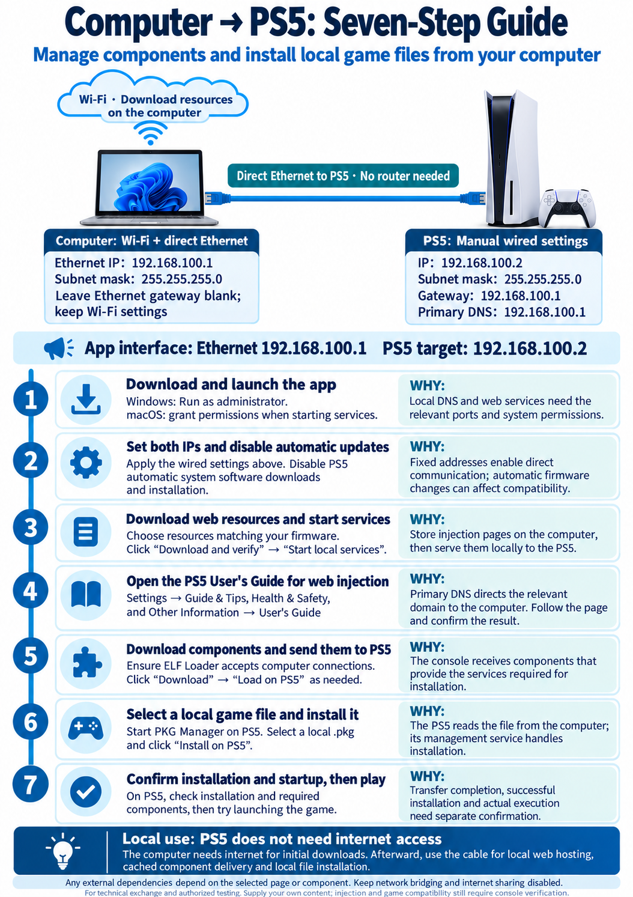

# Detailed usage and development guide

[Back to README](../README.en.md) | [简体中文](usage.zh-CN.md)

## Direct computer-to-PS5 network setup

Follow the [seven steps in the README](../README.en.md#seven-steps-from-setup-to-playing). Use the computer's Wi-Fi interface to download resources over your usual network, and connect its Ethernet interface directly to the PS5 with a cable. No router is needed between them.



| Setting | Computer Ethernet interface | PS5 wired network |
| --- | --- | --- |
| IPv4 | `192.168.100.1` | `192.168.100.2` |
| Subnet mask | `255.255.255.0` | `255.255.255.0` |
| Default gateway | Leave blank | `192.168.100.1` |
| Primary DNS | Leave blank; retain Wi-Fi settings | `192.168.100.1` |

Enter the address and mask in the computer Ethernet interface's IPv4 properties, keeping Wi-Fi unchanged. On the PS5, select a wired connection and manually enter the network settings. Disable automatic system software downloads and installation. On Windows, use “Run as administrator”; on macOS, grant permissions when starting services. This app does not change the PS5 network settings or disable updates for you.

Select `192.168.100.1` as the app's interface and save `192.168.100.2` as its PS5 target. A gateway setting alone does not make the computer forward internet traffic. Keep bridging and internet sharing disabled. If Wi-Fi already uses `192.168.100.0/24`, resolve the interface subnet conflict before using these addresses.

Initial app, repository, and component downloads require internet access on the computer. Web files and verified components stay in its app user data directory. Local services, cached component delivery, local PKG installation, and FTP transfers then use the direct cable. Pages or third-party components may have their own external dependencies; check their instructions. The PS5 does not need internet access through the computer.

## Host a web page locally

1. Configure the direct connection using the table above. Select the computer Ethernet IPv4 interface at `192.168.100.1` in the app.
2. “File source” is prefilled with `https://github.com/ntfargo/Relapse-Exploit` on first launch or when the saved URL is empty. The default entry file is `index.html`; saved custom URLs and the source of downloaded content are retained. Check the selected repository's firmware compatibility; prefilling does not confirm PS5 hardware compatibility. You can use another public GitHub repository root URL or direct HTTPS ZIP URL and set the relative entry path inside the archive. A Release page URL is not a direct ZIP URL. Prefilling does not trigger a download.
3. Click “Download and verify.” For a GitHub repository, the app resolves the default branch to an exact commit before downloading the archive. Files go into the app's user data directory. A failed or canceled download retains the previous usable files.
4. Click “Start local services.” By default, the app listens on DNS UDP/TCP 53, HTTPS 443, and HTTP 8000. Grant any required system permission. An occupied port produces an error.
5. Set PS5 primary DNS to `192.168.100.1`. Open Settings → Guide & Tips, Health & Safety, and Other Information → User's Guide, and follow the selected repository's web injection instructions. Menu names can vary with firmware or language. The HTTP URL is for computer or local network testing only.
6. Check “PS5 HTTPS access” and the activity log. A received request does not prove that the PS5 trusts the self signed certificate or that a page or third party program ran successfully.

The app generates a self signed certificate with a SAN for the target domain and renews it when the domain changes or expiry approaches. It does not install the certificate as a system root.

## Components and local PKGs

1. Enter and save PS5 IPv4 `192.168.100.2` separately at the top of the app. Confirm that the ELF Loader available after injection accepts computer connections. Saving the address does not probe the console. Computer Ethernet address `192.168.100.1` remains the address for DNS and web hosting.
2. Under “Install components,” inspect the upstream source and download the component you need. The app verifies the pinned release asset's SHA-256 hash. Only when you click “Load on PS5” does it check the default port 9021 and send the ELF. Confirm WebKit Autoloader and Kstuff FPKG operation on the PS5; PKG Manager readiness is checked through its default port 8844.
3. Payload Manager v0.5.2 can be checked and its management page opened without a local ELF download. The app checks its version and service response on port 8084. Loading skips the send when it is already running; after a send the app waits up to 30 seconds for confirmation. Payload Manager may execute an existing console autoload list. This app does not change that list.
4. Under “Install a local PKG,” select or drop one `.pkg` from your computer and click “Install on PS5.” The app transfers it in segments through PKG Manager Direct Install. This needs no SMB share and does not depend on port 9021. Keep the computer and source file available until the PS5 reports an installation result.

On firmware 7.00–13.60, WebKit Autoloader's default ELF Loader may accept connections only from the PS5 itself. To send an ELF from a computer, first enable LAN connections according to the [upstream instructions](https://github.com/itsPLK/ps5-webkit-autoloader/blob/v0.5.1/README.md). Payload Manager and PKG Manager are different programs.

Pinned releases: WebKit Autoloader v0.5.1, PKG Manager v1.4.1, Kstuff FPKG 1.13-fpkg-dr-test5, Payload Manager v0.5.2, ShadowMountPlus 1.7beta2, FTP Server (drakmor) 1.16-ng-stable, and PS5 Web File Manager v1.9. Download an older cached Autoloader again to pass the new checksum. Relapse in Autoloader v0.5.1 requires an active Wi-Fi or Ethernet connection, even without internet access.

After sending FTP Server, confirm startup on the console and connect an FTP client to the PS5 address on port 2121. After sending Web File Manager, open `http://<PS5-IP>:<reported-port>/` in your browser. Its default port is 8888 and it tries higher ports if occupied; use the startup notification. These two components report transmission only. This project has not verified their operation on firmware 13.40. Archive extraction requires the separately obtained upstream `wfm-7zip-helper.elf`; this app does not download or install that helper.

Kstuff now uses the user supplied [GBAtemp test5 attachment](https://gbatemp.net/attachments/kstuff-1-13-fpkg-dr-test5-elf-7z.593030/), extracted after download. Both the archive and ELF have pinned sizes and SHA-256 hashes computed from the downloaded files; these have not been compared with author published hashes. FPKG compatibility on firmware 13.40/13.60 is unverified. Download again to replace the old Lite 1.11 cache; the component ID stays compatible. GBAtemp downloads directly without the GitHub mirror.

### ShadowMountPlus image loading

The app supports user-initiated download, verification and delivery of `shadowmountplus.elf` from [ShadowMountPlus 1.7beta2](https://github.com/drakmor/ShadowMountPlus/releases/tag/1.7beta2). The ELF is not bundled. Its pinned size and SHA-256 were checked against the GitHub release asset. Upstream lists Kstuff-lite v1.07+ as its runtime environment and declares support through firmware 13.60 for the 1.7 series. This project has not verified specific firmware, games or the current Kstuff FPKG test-version combination.

1. Prepare an ELF Loader accepting computer connections and a compatible Kstuff environment on PS5.
2. Under “Install components,” click ShadowMountPlus “Download” → “Load on PS5.” Check for the ShadowMount+ startup notification on the console. “ELF sent” confirms transfer only; the app does not confirm service operation or scanning through the API.
3. Uploaded images should be at `/data/homebrew/<filename>`, such as `/data/homebrew/PPSA22999.exfat`. ShadowMountPlus scans `/data/homebrew` by default. If `/data/shadowmount/config.ini` contains `scanpath` entries, only custom scan roots are used; include that directory.
4. Place `sce_sys/param.json` and game files at the image root, without an extra directory layer. Wait for scanning and registration notifications, then try launching on PS5. By default, images mount on demand at game startup; upload completion does not establish registration or successful execution.
5. If the startup notification is missing, check the ELF Loader. If a game entry is missing or startup fails, inspect `/data/shadowmount/debug.log` and console notifications, then check scan roots, image layout, integrity and runtime compatibility. Loading the component does not require re-uploading an existing image.

The upstream management API defaults to PS5 loopback `127.0.0.1:10101`. This app does not automatically change its listener settings or offer remote scanning or mount control. Upstream warns that mounting images may cause shutdown problems or data corruption; back up important data before use. [Upstream usage and troubleshooting](https://github.com/drakmor/ShadowMountPlus/blob/1.7beta2/README.md)

### FTP transfer of game folders and images

1. Save the PS5 target address and start FTP Server on the console. Sending its ELF does not confirm FTP is running.
2. Under “Send game folder / image”, choose a complete game root folder or an existing `.exfat` / `.ffpkg` image. Folders must contain a nonempty `eboot.bin` and a `sce_sys/param.json` with a `titleId`. Symbolic links, directory junctions and unsafe filenames are rejected. Image selection checks the extension and basic file conditions, not internal game contents or compatibility. `.ffpkg` is an image, distinct from an FPKG installation package.
3. Check the FTP port (default 2121) and click “Send to PS5”. This feature uses anonymous FTP login without storing credentials, and requires a console service that permits that login method.
4. Files are staged under `/data/.ps5-local-host-<task-id>/`. After checking each remote file size, the app renames the completed folder or image into `/data/homebrew/<selected-name>`. Existing destinations are rejected; do not modify the destination with other tools during transfer. Size checking is not a content hash check. Source file changes stop the task.
5. Progress and cancellation appear in the task area. After failure or cancellation, the app attempts to remove only this task's temporary files; technical details record the staging path when cleanup fails. A lost connection during the final rename produces an unconfirmed result that needs checking on PS5. Resume, overwrite updates, storage destination selection and image creation are not available yet.
6. Follow the [image loading steps](#shadowmountplus-image-loading) to confirm ShadowMountPlus scanning, registration and startup on PS5. You can explicitly download and send it under “Install components”; the app does not do so automatically or verify console mount results. Firmware 13.00 and individual game compatibility still require hardware testing.

### GitHub mirror

“GitHub mirror acceleration” under “File source” is off by default. When enabled, new downloads of public GitHub repository API responses, ZIPs, and component assets go through the third party `gh-proxy.org` service. Changing the setting does not interrupt a current task or change DNS, HTTPS, or PS5 connections. The mirror provider receives the requested public resource URL. The app does not route account credentials, URLs with query parameters, or ZIPs from other sites through the mirror. Component SHA-256 checks still apply. Ordinary web ZIPs have no pinned trusted hash, so assess the source and mirror yourself. If the mirror fails, turn it off and retry.

## Network and local data

| Area | Behavior |
| --- | --- |
| DNS | Only A queries for the target domain (default `manuals.playstation.net`) receive the selected computer IPv4 address. AAAA has no address; other domains return NXDOMAIN. Public DNS requests are not forwarded. |
| Web | HTTPS and HTTP serve the same downloaded files. `/document/<language>/ps5/` redirects to the selected entry file; missing files return 404. |
| Internet requests | The app contacts upstream sources only for user initiated downloads. User provided pages or scripts may make their own external requests. |
| PS5 connections | The app contacts the saved PS5 address when the user requests ELF delivery, PKG installation, game folder / image transfer, or a component status check. |
| Local storage | Configuration, downloaded files, and certificate private keys live in Electron's user data directory, outside the package. Services must be started manually after relaunch. |

To check whether a page works offline, disconnect the computer from the internet after downloading and starting the services, while keeping its local connection to the PS5.

## Troubleshooting

| Symptom | Check |
| --- | --- |
| Services will not start | Check the selected interface, system permissions, and whether another DNS, proxy, or app occupies ports 53, 443, or 8000. |
| The PS5 cannot open the page | Check the direct cable and the network table above, select Ethernet interface `192.168.100.1`, set PS5 primary DNS to that address, and check the HTTPS log. Certificate and page behavior still need hardware confirmation. |
| A download fails | Check the GitHub repository or direct HTTPS ZIP URL and the relative entry path. If using the mirror, turn it off and retry. |
| ELF or PKG action fails | Check the saved PS5 IPv4 address, the relevant service on port 9021 or 8844, and the task log. |

If port 53 is occupied, use `--diagnostic-ports` for temporary computer side tests on DNS 5354, HTTPS 8443, and HTTP 18000:

```bash
npm start -- --diagnostic-ports
```

The same flag can be appended when launching a packaged app from a command line. Diagnostic mode cannot be used for PS5 access because the PS5 DNS setting cannot specify port 5354. A normal relaunch restores the default ports.

## Run from source

Use Node.js 22.12 or later:

```bash
npm ci
npm start
```

If the Electron download is incomplete, run `node node_modules/electron/install.js`, then try again.

## Development and builds

```bash
npm test
npm run pack:dir
npm run pack:mac
npm run pack:win
```

`pack:mac` produces a DMG and ZIP on macOS; `pack:win` produces an NSIS installer and portable executable on Windows. Distributors need their own credentials for macOS signing and notarization and Windows signing. `npm test` uses ordinary test pages and high local ports to cover downloads, DNS, HTTPS, static resources, certificate reuse, and port release. Automated tests do not replace PS5 hardware verification.
