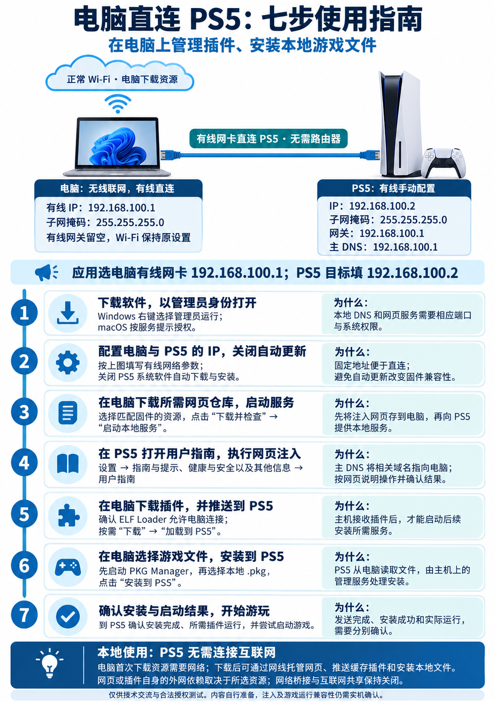

# 详细使用与开发指南

[返回首页](../README.md) | [English](usage.en.md)

## 自动配置 IP 与清除

顶部“连接模式与电脑 IP 配置”提供单网卡（同一路由器）和双网卡（另一块网卡直连 PS5）模式。选择物理网卡和服务 IP 后点击“自动配置 IP”，按系统提示授权。默认 `192.168.100.1/24`，可改为其他末位为 `.1` 的私有 IPv4 地址；掩码固定为 `255.255.255.0`，PS5 建议使用同网段 `.2`。配置成功后自动选中新增地址作为本地服务地址；请手动设置 PS5，并在应用中保存其地址。

单网卡选择已有 IPv4 和默认网关的联网网卡，电脑与 PS5 连接同一路由器；路由器需关闭 AP／客户端隔离，访客网络和部分网络策略可能阻止互访。双网卡选择直连 PS5 且没有默认网关的网卡。PS5 主 DNS、网关均填写电脑服务 IP，这仅用于本地连接，不提供外网转发；电脑原有网关、DNS、DHCP 和联网地址保留。

操作前须停止本地服务及下载、传输、远端任务。工具读取实际网卡与地址，检查其他网卡和 Windows 路由中的网段冲突；Windows 还检查地址重复检测结果。不能以这些检查保证局域网中没有占用或隔离，仍需实机确认。已有同地址只用于服务，不记录为工具新增地址。若其他网卡或路由使用相交网段（包括较大的掩码），请选择不冲突的私有网段，并同步调整 PS5。

Windows 使用临时的 DHCP／静态地址共存设置；网卡已有可用地址时，新增地址不自动选作源地址，以保留普通联网流量的地址选择；直连网卡原本没有可用地址时，允许使用新增地址发起连接。无法确认共存能力时停止操作。macOS 使用临时 IPv4 alias。新增地址及工具修改的共存设置仅在本次开机有效，退出软件不会移除；重启电脑后需要重新配置。

“清除本工具配置”根据用户数据目录中的 `network-config.json` 记录定位网卡和地址，只移除本工具新增地址，并恢复由本工具开启的共存设置。它不会清空网卡、恢复整份旧网络快照或删除用户原有 IP。若期间其他软件新增了依赖共存设置的静态地址，会保留共存设置和清除记录并提示检查。电脑重启后旧记录只作失效清理，不按旧记录删除当前地址。

配置中断、授权取消或恢复失败时保留记录，下次打开软件后先检查提示并执行清除，再重试。原联网配置变化或结果无法确认时不报告成功；请核对系统网络设置。不要手动删除记录后反复配置。当前验证包括两平台命令与故障场景模拟，以及一台 Windows 电脑上的真实有线、Wi-Fi 添加与清除测试。测试通过应用使用的配置模块和辅助进程执行，验证了新增地址的本机 TCP 通信、公网 HTTPS 请求，以及原有 IP、DHCP、网关、DNS 和共存设置在清除后的恢复；未覆盖无原有地址的直连网卡、macOS 实机、重启后的失效行为或 PS5 端互通。

## 电脑直连 PS5 的网络配置

主流程见 [README 的七个步骤](../README.md#从准备到游玩的七个步骤)。电脑用无线网卡连接正常 Wi-Fi 下载资源，用有线网卡和一根网线直连 PS5；电脑与 PS5 之间无需路由器。



| 设置 | 电脑有线网卡 | PS5 有线网络 |
| --- | --- | --- |
| IPv4 | `192.168.100.1` | `192.168.100.2` |
| 子网掩码 | `255.255.255.0` | `255.255.255.0` |
| 默认网关 | 留空 | `192.168.100.1` |
| 主 DNS | 留空，保留 Wi-Fi 原设置 | `192.168.100.1` |

在电脑有线网卡的 IPv4 属性中填写地址和掩码；不要将这些值填到无线网卡。PS5 选择有线连接并手动填写网络参数，同时关闭系统软件自动下载、自动安装。Windows 应用使用“以管理员身份运行”，macOS 按服务启动时的提示授权。本工具不会替你修改 PS5 的网络设置或关闭更新。

应用网卡选 `192.168.100.1`，PS5 目标填 `192.168.100.2`。固定网关不等于电脑会转发外网流量，本流程保持网络桥接和互联网共享关闭。若正常 Wi-Fi 已使用 `192.168.100.0/24` 网段，应先解决两块网卡的网段冲突，再使用这套地址。

首次下载软件、网页仓库和插件需要电脑联网。网页和校验通过的插件保存在应用用户数据目录；之后启动本地服务、发送缓存插件、安装本地 PKG 和 FTP 传输都走直连网线。网页或第三方组件可能有自己的外网依赖，需按其说明判断。PS5 无需通过电脑连接互联网。

## 使用本地网页服务

1. 按前述单网卡或双网卡步骤配置网络，在应用中选择电脑服务 IP（默认 `192.168.100.1`）。
2. “文件来源”在首次打开或旧配置地址为空时预填 `https://github.com/ntfargo/Relapse-Exploit`，网页入口默认 `index.html`；已保存的自定义地址和已下载资源的来源继续保留。确认所选仓库与你的固件兼容；预填不代表已完成 PS5 实机验证。你也可以改为其他公开 GitHub 仓库根地址或 HTTPS ZIP 直链，并设置归档内的网页入口相对路径。Release 页面地址不是 ZIP 直链，预填地址不会自动触发下载。
3. 点击“下载并检查”。GitHub 仓库会先确定默认分支的具体提交，再下载归档。成功后文件保存在应用用户数据目录；失败或取消不会替换上一份可用文件。
4. 点击“启动本地服务”。应用默认监听 DNS UDP/TCP 53、HTTPS 443 和 HTTP 8000。按系统提示授予必要权限；端口占用会显示错误。
5. PS5 主 DNS 设为 `192.168.100.1`，进入“设置 → 指南与提示、健康与安全以及其他信息 → 用户指南”，按所选仓库的说明进行网页注入；菜单名称可能随版本或语言变化。HTTP 地址仅用于电脑或局域网测试。
6. 查看“PS5 HTTPS 访问”和活动日志。收到请求不代表 PS5 已信任自签证书，也不代表网页或第三方程序执行成功。

应用会自动生成包含目标域名 SAN 的自签证书，并在域名变化或证书临近过期时更新；它不会安装为系统根证书。

## 组件与本地 PKG

1. 在顶部单独填写并保存 PS5 的 IPv4 地址 `192.168.100.2`，确认注入后的 ELF Loader 已允许电脑连接。保存地址不会探测主机；电脑有线地址 `192.168.100.1` 仍用于 DNS 和网页服务。
2. 在“安装插件”区查看上游来源，主动下载所需组件。应用会校验固定发布附件的 SHA-256；只有点击“加载到 PS5”后，才会检查默认 9021 端口并发送 ELF。WebKit Autoloader 与 Kstuff FPKG 发送后需在 PS5 上确认运行；PKG Manager 就绪情况通过默认 8844 接口检查。
3. Payload Manager v0.5.2 的“检查状态”和“打开管理页面”无需先下载 ELF；应用通过固定端口 8084 检查版本与服务响应，确认后才打开官方页面。加载时若已运行则不重复发送；发送后最多等待 30 秒确认，超时只报告“已发送，启动未确认”。Payload Manager 可能执行主机已有自动加载列表，本应用不会修改该列表。
4. 在“安装本地 PKG”区选择或拖入电脑上的单个 `.pkg`，点击“安装到 PS5”。应用通过 PKG Manager Direct Install 分段传输，无需 SMB 共享，也不依赖 9021。保持电脑和源文件可用，直到 PS5 返回安装结果。

在 7.00–13.60 固件上，WebKit Autoloader 默认 ELF Loader 可能仅接受 PS5 本机连接。若需从电脑发送 ELF，请先按[上游说明](https://github.com/itsPLK/ps5-webkit-autoloader/blob/v0.5.2/README.md)启用局域网连接。Payload Manager 与 PKG Manager 是不同程序。

固定版本：WebKit Autoloader v0.5.2、PKG Manager v1.4.1、Kstuff FPKG 1.13-fpkg-dr-test5、Payload Manager v0.5.2、ShadowMountPlus 1.7beta2（默认）/ 1.7beta3（可选预发布）、FTP Server（drakmor）1.16-ng-stable、PS5 Web File Manager v1.9。缓存的旧版 Autoloader ELF 需重新下载才能通过新版校验。Autoloader v0.5.2 的 Relapse 需要有效的 Wi-Fi 或以太网连接，即使没有互联网也需要。

[Autoloader v0.5.2](https://github.com/itsPLK/ps5-webkit-autoloader/releases/tag/v0.5.2) 移除了启动遮罩，打开入口即可看到加载及注入日志；上游还简化了固件检测，并为 9.05 / 11.40 自动选择 Poops。应用只在用户点击“下载”时获取新版，既有 PS5 安装不会自动升级；下载后按上游说明加载安装器，并在主机确认结果。新版 ELF 的大小及 SHA-256 已与 GitHub 附件元数据核对，固件兼容性仍以实机结果为准。

发送 FTP Server 后，在主机上确认启动，再用 FTP 客户端连接 PS5 地址的 2121 端口。发送 Web File Manager 后，在浏览器打开 `http://<PS5-IP>:<通知中的端口>/`；默认 8888，端口占用时尝试更高端口，以启动通知为准。这两个组件只报告发送结果，本项目尚未验证其在 13.40 上的运行。解压功能需要另行获取上游 `wfm-7zip-helper.elf`；本应用不下载或安装此 helper。

Kstuff 改为用户指定的 [GBAtemp test5 附件](https://gbatemp.net/attachments/kstuff-1-13-fpkg-dr-test5-elf-7z.593030/)，下载后自动解压。压缩包和 ELF 分别固定大小与 SHA-256；这些校验值来自本地下载核验，尚未与作者公布值核对。13.40/13.60 FPKG 兼容性未验证。旧 Lite 1.11 缓存需重新下载；组件 ID 保持兼容。GBAtemp 下载直连，不使用 GitHub 镜像。

### Y2JB Autoloader 安装

这是首次破解后的 FTP 安装功能，不依赖 9021；PS5 必须已有可访问 `/user/download` 的匿名 FTP 服务，默认端口 2121。按 [Y2JB Autoloader 上游说明](https://github.com/itsPLK/ps5-y2jb-autoloader#setup-instructions)准备兼容的 YouTube、账号及更新阻止设置。应用不会安装 YouTube PKG、修改账号、修改系统数据库或恢复系统备份。

- 默认可选 [v0.9.1 正式版](https://github.com/itsPLK/ps5-y2jb-autoloader/releases/tag/v0.9.1-36381e4)：尚未集成 Relapse；其发布说明指出 12.70 以上仍需其他内核漏洞，不能把新版 YouTube 用户态支持理解为完整破解支持。
- 可选 [v1.0.0-dev-794049f](https://github.com/itsPLK/ps5-y2jb-autoloader/releases/tag/v1.0.0-dev-794049f)：Relapse 目标固件为 10.20–13.60，属于需要测试的预发布版。两个版本均未由本项目实机验证。
- 两个版本的 `download0.dat` 均为 336,789,504 字节，按需从上游下载并独立缓存。固定大小及 SHA-256 已核对 GitHub 发布附件元数据，不随应用打包。

保存 PS5 地址，在组件卡片选择版本、实际安装的 YouTube 应用 ID（PPSA01650 / PPSA01651 / PPSA01652）及 FTP 端口。完全关闭 YouTube，确认准备完成后点击“通过 FTP 安装”。仅下载文件不会改变 PS5。

安装时先向对应 `/user/download/<应用 ID>/` 上传随机命名的临时文件，再通过 FTP 回读完整文件核对 SHA-256，因此会额外传回约 321 MiB。校验通过后，将原 `download0.dat` 重命名为 `download0.dat.backup-<唯一标识>`，再启用新文件。保留备份与新文件需要额外可用空间；界面显示备份路径。已有自动加载配置和载荷不被改写。

如上传或校验失败，原文件不替换，尝试清理临时文件。如果替换阶段失败，工具会重新连接，在目标缺失且备份存在时尝试恢复原文件。若连接中断导致替换结果无法确认，会保留相关文件并提示检查。先关闭 YouTube，用 FTP 检查界面给出的目标、备份及临时路径，必要时保留当前文件后将备份恢复为 `download0.dat`；勿在结果未确认时反复安装。清理或恢复也可能因 FTP 中断而失败，届时需手动检查。

显示“文件已安装”仅表示 FTP 文件部署完成。请在 PS5 打开 YouTube 确认实际执行；后续每次重启仍需运行入口。在没有 `autoload.txt` 时会启动 Payload Manager，可在那里配置所需插件的自动加载。现有 `autoload.txt` 会影响启动行为，USB 配置优先；如需脱离 USB，按上游说明将配置和载荷放到主机内部存储。安装器不会自动把电脑已下载的其他插件配置成自动加载，也不能保证所有插件组合兼容。

### ShadowMountPlus 镜像加载

本应用支持用户主动下载、校验并推送 [ShadowMountPlus 1.7beta2](https://github.com/drakmor/ShadowMountPlus/releases/tag/1.7beta2) 的 `shadowmountplus.elf`；不将该 ELF 附带在构建包中。固定大小和 SHA-256 已与 GitHub 发布附件核对。上游说明列出 Kstuff-lite v1.07+ 作为运行环境，1.7 系列声明支持至 13.60；本项目尚未验证具体固件、游戏或当前 Kstuff FPKG 测试版的组合。

版本选择默认保留 **1.7beta2**，也可选择 [1.7beta3（预发布）](https://github.com/drakmor/ShadowMountPlus/releases/tag/1.7beta3)。beta3 的大小及 SHA-256 已与 GitHub 附件元数据核对；上游更新包括自定义扫描路径下的 backports 挂载修复、ffpfsc 挂载参数调整，以及禁用 API 时不再自动创建图标。该更新未确认能解决游戏启动黑屏，beta3 的游戏运行尚未实机验证。

试用方法：先在 PS5 完全关闭游戏，在 ShadowMountPlus 卡片的“版本”选择 beta3 → “下载” → “加载到 PS5”，然后检查主机启动通知与日志。两个版本独立缓存和校验，选择版本本身不会下载或发送文件。需要切回时选择 beta2，已缓存并通过校验则可直接再次加载；否则先下载。切换只更换所发送的 ELF，不恢复 PS5 上的配置或数据；无需仅为换插件重复上传游戏。

1. 在 PS5 准备允许电脑连接的 ELF Loader 和兼容的 Kstuff 环境。
2. 先完全关闭游戏，在“安装插件”选择 ShadowMountPlus 版本，再点击“下载” → “加载到 PS5”，检查主机的 ShadowMount+ 启动通知。本应用显示“ELF 已发送”只确认传输；未通过 API 确认服务运行或扫描结果。
3. 已发送镜像应位于 `/data/homebrew/<文件名>`，例如 `/data/homebrew/PPSA22999.exfat`。ShadowMountPlus 默认扫描 `/data/homebrew`；若 `/data/shadowmount/config.ini` 设置了 `scanpath`，仅使用自定义扫描根，需包含该目录。
4. 镜像内部的 `sce_sys/param.json` 和游戏文件应位于镜像根目录，不要额外套一层目录。等待扫描与游戏注册通知，再在 PS5 尝试启动。默认按需在游戏启动时挂载镜像；上传完成不会自动证明已注册或可运行。
5. 无启动通知时先检查 ELF Loader；无游戏入口或无法启动时，查看 `/data/shadowmount/debug.log` 与主机通知，再检查扫描目录、镜像结构、完整性及运行环境。不要仅为加载插件重复上传已有镜像。

上游管理 API 默认为 PS5 本机 `127.0.0.1:10101`，当前应用不自动修改其网络监听配置、不提供远程扫描或挂载控制。上游明确提示镜像挂载可能造成关机问题或数据损坏，使用前备份重要数据。[上游使用与排查说明](https://github.com/drakmor/ShadowMountPlus/blob/1.7beta2/README.md)

### 游戏目录与镜像的 FTP 发送

1. 保存目标 PS5 地址，在主机上启动 FTP Server；发送 ELF 完成不代表 FTP 已运行。
2. 在“发送游戏目录 / 镜像”选择完整游戏根目录，或已有的 `.exfat` / `.ffpkg` 镜像。目录必须包含非空 `eboot.bin` 和含 `titleId` 的 `sce_sys/param.json`；不支持符号链接、目录联接和不安全文件名。镜像按扩展名和基本文件条件筛选，不验证其内部游戏内容或兼容性。`.ffpkg` 是镜像，与 FPKG 安装包不同。
3. 确认 FTP 端口（默认 2121），点击“发送到 PS5”。本功能使用匿名 FTP 登录，不保存凭据，适用于允许该登录方式的主机 FTP 服务。
4. 文件先上传到 `/data/.ps5-local-host-<任务标识>/`，逐文件核对远端大小后，再重命名至 `/data/homebrew/<所选目录或镜像名称>`。已有同名目标会拒绝传输；传输期间请勿用其他工具修改目标。大小核对不是内容哈希校验。源文件变化会中止任务。
5. 进度及取消按钮位于任务区域。取消或失败后尝试清理本任务临时文件；无法清理时，技术详情记录残留路径。连接在最终重命名时中断则报告结果未确认，需到 PS5 检查。断点续传、覆盖更新、存储位置选择和镜像制作尚未提供。
6. 完成后按[镜像加载步骤](#shadowmountplus-镜像加载)在 PS5 确认 ShadowMountPlus 扫描、注册及启动。可在“安装插件”主动下载并发送该加载器；本应用不会自动执行此操作，也不验证主机的挂载结果。PS5 13.00 及具体游戏的运行兼容性仍待实机验证。

### GitHub 镜像加速

“文件来源”中的“GitHub 镜像加速”默认关闭。开启后，新发起的公开 GitHub 仓库 API、ZIP 和组件附件下载会通过第三方 `gh-proxy.org`；切换不会中断当前任务，也不改变 DNS、HTTPS 或 PS5 连接。服务商会收到请求的公开资源地址。应用不会通过镜像转发账号凭据、带查询参数的地址或其他站点 ZIP；组件仍校验内置 SHA-256。普通网页 ZIP 没有预置可信摘要，请自行判断来源和镜像是否可信。镜像失败时可关闭开关重试。

## 网络与本地数据

| 项目 | 行为 |
| --- | --- |
| DNS | 仅将目标域名（默认 `manuals.playstation.net`）的 A 查询回答为所选电脑 IPv4；AAAA 不提供地址，其他域名返回 NXDOMAIN；不转发公网 DNS。 |
| 网页 | HTTPS 和 HTTP 托管同一份已下载文件；`/document/<语言>/ps5/` 重定向到所选入口，缺失文件返回 404。 |
| 外网请求 | 应用仅在用户主动下载资源时连接上游；用户提供的网页或脚本可能自行访问外网。 |
| PS5 连接 | 用户主动加载 ELF、安装 PKG、发送游戏目录 / 镜像或检查组件状态时，向保存的 PS5 地址发起对应连接。 |
| 本地存储 | 配置、下载文件和证书私钥保存在 Electron 用户数据目录，不进入安装包；重启后须手动启动服务。 |

若要检查网页的离线行为，可在下载并启动服务后断开电脑外网，同时保持电脑与 PS5 的局域网连接。

## 故障排查

| 现象 | 检查项 |
| --- | --- |
| 服务无法启动 | 检查电脑网卡、系统权限，以及 53、443、8000 端口是否被 DNS、代理或其他程序占用。 |
| PS5 无法打开页面 | 检查直连网线，或确认同一路由器允许设备互访；确认应用选中电脑服务 IP，PS5 主 DNS 也是该地址，并查看 HTTPS 请求日志。证书提示和页面行为仍需实机确认。 |
| 下载失败 | 检查 GitHub 仓库或 HTTPS ZIP 直链、入口相对路径；若使用镜像，关闭后重试。 |
| ELF 或 PKG 操作失败 | 确认填写的是 PS5 IPv4，检查对应的 9021 或 8844 服务是否已在 PS5 上就绪，并查看任务日志。 |

若 53 端口被占用，可用 `--diagnostic-ports` 临时测试电脑侧 DNS 5354、HTTPS 8443、HTTP 18000：

```bash
npm start -- --diagnostic-ports
```

打包应用也可在命令行追加此参数。诊断模式不能用于 PS5 实机访问，因为 PS5 DNS 设置无法指定 5354；正常重启应用即可恢复默认端口。

## 从源码运行

需要 Node.js 22.12 或更新版本：

```bash
npm ci
npm start
```

若 Electron 下载未完成，运行 `node node_modules/electron/install.js` 后重试。

## 开发与构建

```bash
npm test
npm run pack:dir
npm run pack:mac
npm run pack:win
```

`pack:mac` 在 macOS 上生成 DMG 和 ZIP；`pack:win` 在 Windows 上生成 NSIS 安装版和便携版。正式分发需要发布者自行提供 macOS 签名、公证及 Windows 签名凭据。`npm test` 使用普通测试网页和本机高端口，覆盖下载、DNS、HTTPS、静态资源、证书复用和端口释放等流程；自动化测试不能代替 PS5 实机验证。
